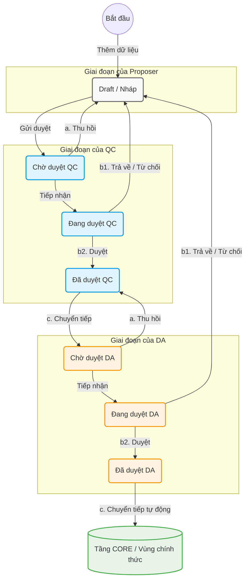
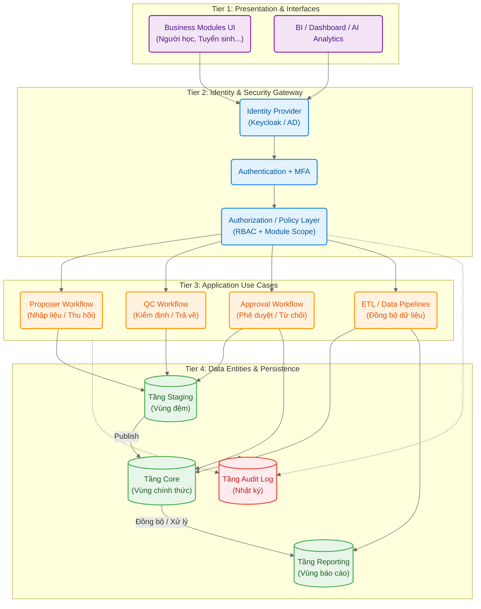

### 1. Bối cảnh và Vấn đề (Context & Problem Statement)

#### 1.1. Bối cảnh hệ thống (System Context) 

> Hệ thống HEMIS Datawarehouse không chỉ dừng lại ở việc lưu trữ các luồng dữ liệu tác nghiệp đơn lẻ, mà đóng vai trò là cốt lõi của **dữ liệu quản trị cấp trường**. Với định hướng phát triển kiến trúc dữ liệu hiện đại, hệ thống yêu cầu một cơ chế phân quyền nền tảng không chỉ kiểm soát quyền truy cập cơ bản (Thêm/Sửa/Xóa) mà còn phải đáp ứng khả năng mở rộng kiến trúc bảo mật theo tiêu chuẩn **Zero Trust**.
> 
> Đồng thời, cấu trúc phân quyền của kho dữ liệu phải được thiết kế để sẵn sàng tích hợp liền mạch với các **hạ tầng định danh (IAM / SSO)**, hệ thống giám sát độc lập (Audit), và cung cấp nguồn dữ liệu đầu ra đáng tin cậy cho các hệ thống phân tích và trí tuệ nhân tạo (BI, EIS, DSS, AI),.

---
#### 1.2. Các vấn đề tồn tại (Problem Statement) 
Mô hình hiện tại đang tiềm ẩn một số rủi ro về bảo mật, tính toàn vẹn dữ liệu và khả năng kiểm toán, cụ thể:

> - **Thiếu sự tách biệt trách nhiệm (SoD - Separation of Duties):** 
> 	Ranh giới giữa các vai trò nghiệp vụ chưa được phân tách nghiêm ngặt, dẫn đến việc không thể truy trách nhiệm rõ ràng khi dữ liệu có sai lệch.
> - **Rủi ro từ đặc quyền quản trị:** 
> 	Tồn tại nguy cơ người quản trị (Admin) can thiệp và chỉnh sửa trực tiếp dữ liệu tại vùng dữ liệu chính thức (tầng Core) mà không qua quy trình kiểm soát, gây nguy hại đến tính toàn vẹn của dữ liệu.
> - **Lỗ hổng trong khả năng truy vết:** 
> 	Dữ liệu nhật ký hệ thống (Audit Log) chưa mang tính độc lập, gây khó khăn cho công tác kiểm định nội bộ và kiểm toán.
> - **Chất lượng dữ liệu không đảm bảo cho hệ sinh thái phân tích:** 
> 	Việc thiếu cơ chế bảo toàn dữ liệu chính thức và luồng phê duyệt rõ ràng khiến dữ liệu thiếu tính tin cậy, từ đó trở thành rào cản lớn khi triển khai tích hợp với các công cụ BI hoặc AI,.

---
#### 1.3. Mục tiêu thiết kế kiến trúc phân quyền V2 (Design Objectives)

Để giải quyết các rào cản trên, phân hệ quản lý quyền của HEMIS Datawarehouse (phiên bản V2) được thiết kế nhằm đảm bảo các tiêu chí kỹ thuật và nghiệp vụ cốt lõi:

> - Áp dụng mô hình **RBAC có kiểm soát** kết hợp với **phạm vi theo phân hệ (Module Scope)** để đảm bảo cấp quyền đúng vai trò nghiệp vụ.
> - Thực thi nguyên tắc **phân tách trách nhiệm (SoD)** trong toàn bộ vòng đời của dữ liệu.
> - Thiết lập cơ chế **bảo toàn dữ liệu chính thức**, ngăn chặn mọi hành vi thay đổi trái phép tại tầng Core.
> - Xây dựng cơ chế **Audit độc lập**, đảm bảo truy vết được mọi thay đổi diễn ra trong kho dữ liệu.


**Hình 1:** Tóm tắt bối cảnh

---
### 2. Mô hình Khái niệm Đề xuất (Proposed Conceptual Model)

#### 2.1. Nguyên tắc phân quyền đa chiều (Multi-dimensional Authorization Principles) 

Nhằm đáp ứng tiêu chuẩn Zero Trust và nguyên tắc đặc quyền tối thiểu (Least Privilege), cơ chế phân quyền của HEMIS V2 không gán quyền tĩnh trực tiếp cho người dùng, mà được tính toán động dựa trên sự kết hợp của ba chiều không gian quyền. Cụ thể, định mức truy cập của một người dùng được xác định bởi công thức: 

```bash
User Permission = Role + Module Scope + Data Layer Scope
```

Trong đó:

> - **$Role$ (Vai trò):** Xác định tư cách nghiệp vụ hoặc kỹ thuật của người dùng (VD: Proposer, Data Approver, System Administrator).
> - **$Module Scope$ (Phạm vi phân hệ):** Giới hạn vùng dữ liệu nghiệp vụ mà người dùng được phép can thiệp (VD: Phân hệ Người học, Tuyển sinh, Đội ngũ).
> - **$Data Layer Scope$ (Phạm vi tầng dữ liệu):** Xác định các thao tác khả dụng tương ứng với từng vùng dữ liệu trong Database (VD: Tầng Staging, Core, Reporting).

**Ví dụ thực tế với vai trò Proposer (Người nhập liệu/Đề xuất):** Nếu một chuyên viên thuộc Phòng Đào tạo được gán vai trò **Proposer** phụ trách phân hệ **"Người học"**, hệ thống sẽ áp dụng nguyên tắc trên để giới hạn quyền hạn như sau:

> - **Trên tầng Staging (Vùng đệm):** Người này có quyền tạo mới (Create), cập nhật (Update) và xem (Read) các bản ghi dữ liệu sinh viên thuộc phân hệ Người học. Ngoài ra, Proposer **được phép xóa mềm (Soft Delete) tùy ý**; giải thích kỹ hơn, thao tác này thực chất là ẩn vùng dữ liệu đó đi bằng cách thay đổi trạng thái (status) từ 'appear' sang 'delete' (bên cạnh việc thay đổi các trạng thái luồng công việc như draft, submitted, withdrawn, rejected) nhằm bảo toàn toàn bộ lịch sử dữ liệu.
> - **Trên tầng Core (Vùng chính thức):** Người này hoàn toàn **không có quyền can thiệp (X)**, đảm bảo dữ liệu gốc không bị chỉnh sửa trái phép.
> - **Trên tầng Reporting:** Chỉ được giới hạn xem (Read) các báo cáo, dashboard liên quan trực tiếp đến phân hệ Người học nếu được cấp phép.

---
#### 2.2. Kiến trúc các tầng dữ liệu chuẩn (Standard Data Layers Architecture) 

Để đáp ứng nguyên tắc phân quyền trên, cơ sở dữ liệu (Database) của HEMIS Datawarehouse được thiết kế tách bạch thành 4 tầng (lớp) chuẩn, mỗi tầng đóng một vai trò riêng biệt trong vòng đời luân chuyển dữ liệu:

> - **Tầng Staging (Vùng đệm tiếp nhận dữ liệu):** Đây là phân vùng Database làm nhiệm vụ nhập liệu, tiếp nhận các bản ghi mới hoặc dữ liệu đang trong quá trình cập nhật. 
>
> - Dữ liệu tại đây **chưa mang tính chính thức** và là nơi duy nhất các vai trò như Proposer có thể thực hiện thao tác Thêm/Sửa/Xóa(Mềm)

> - **Tầng Core (Vùng dữ liệu trung tâm/chính thức):** Lưu trữ dữ liệu chính thức đã vượt qua các vòng kiểm tra (Quality Control) và được phê duyệt (Data Approved). 
>
> - Dữ liệu tại tầng Core đóng vai trò là "Single Source of Truth" dùng cho nghiệp vụ chính thống và tích hợp với các hệ thống downstream. Quy tắc bảo mật cốt lõi tại đây là **không một cá nhân nào được phép sửa trực tiếp vào database Core** ngoài trường hợp đặc biệt; mọi thay đổi bắt buộc phải tạo yêu cầu chỉnh sửa ở Staging và đi qua luồng phê duyệt (Data Approval Workflow). Chỉ có hệ thống (thông qua lệnh của Data Approver) mới có quyền đẩy dữ liệu từ Staging sang Core.

> - **Tầng Reporting (Vùng khai thác & Phân tích):** Phân vùng Database được tối ưu hóa bằng các Data Mart chuẩn để phục vụ trích xuất báo cáo, Dashboard, BI (Business Intelligence), EIS và các hệ thống AI. 
>
> - Quy tắc tại đây là **chỉ hỗ trợ truy vấn đọc (Read-only)**; hoàn toàn không cho phép sửa đổi dữ liệu báo cáo bằng tay.

> - **Tầng Audit Log (Vùng nhật ký hệ thống):** Đây là lớp Database lưu trữ toàn bộ lịch sử thao tác, quy trình phê duyệt, thay đổi phân quyền và lịch sử truy cập. 
>
> - Tầng này hoạt động độc lập và tuân thủ quy tắc **Append-only (Chỉ ghi thêm) do hệ thống tự sinh**; tuyệt đối không ai (kể cả System Administrator hay Security Administrator) được phép sửa hoặc xóa dữ liệu log thông qua giao diện nghiệp vụ.


**Hình 2:** Tóm tắt các tầng

---
#### 2.3. Các vai trò chuẩn HEMIS v2

Hệ thống HEMIS v2 áp dụng mô hình phân quyền dựa trên vai trò (RBAC) với danh sách các vai trò chuẩn được thiết kế nghiêm ngặt theo đặc thù quản trị cấp trường, chia thành 3 nhóm trọng tâm:

**Nhóm vai trò nghiệp vụ (Business Roles):** Đảm nhiệm vòng đời của luồng dữ liệu.

> - **Proposer:** Nhập liệu / đề xuất thay đổi dữ liệu.
> - **Quality Controller (QC):** Kiểm tra tính hợp lệ, đầy đủ, logic dữ liệu.
> - **Data Approver:** Phê duyệt dữ liệu đưa vào core.
> - **Viewer:** Xem báo cáo, dashboard, dữ liệu đã được cấp quyền.

**Nhóm vai trò quản trị (Administrative Roles):** Đảm nhiệm vận hành, bảo mật và kiểm soát hệ thống.

> - **System Administrator:** Quản trị hạ tầng, cấu hình hệ thống, tham số kỹ thuật.
> - **Security Administrator:** Quản lý phân quyền, role, group, policy, MFA.
> - **Audit Viewer:** Chỉ xem log, truy vết, phục vụ kiểm soát nội bộ / kiểm toán.

**Vai trò đặc biệt (Special Roles):**

> - **Break-Glass Administrator:** Quyền khẩn cấp tạm thời, chỉ dùng khi có sự cố nghiêm trọng, bắt buộc log và phê duyệt hậu kiểm.

---
#### **2.4. Định nghĩa quyền thao tác chuẩn (Action Definitions)** 

Để chuẩn hóa ma trận phân quyền, hệ thống quy định các hành động cơ sở sau:

> - **C (Create):** Tạo mới bản ghi.
> - **U (Update):** Cập nhật / chỉnh sửa.
> - **D (Soft Delete):** Xóa mềm (thay đổi trạng thái sang 'delete' để ẩn vùng dữ liệu).
> - **R (Read):** Xem / truy vấn.
> - **A (Approve):** Phê duyệt.
> - **P (Publish):** Đưa dữ liệu sang Core hoặc công bố báo cáo.
> - **X (No Access):** Không có quyền truy cập.

---
#### **2.5. Ma trận phân quyền theo tầng dữ liệu (Role × Data Layer × Action)**

> Bảng ma trận dưới đây quy định nghiêm ngặt quyền hạn của từng vai trò trên 4 tầng kiến trúc dữ liệu. Các vai trò được phân tách thành 3 nhóm (Group) chức năng chính, sắp xếp theo thứ tự ưu tiên từ nhóm Quản trị (Admin), đến nhóm Người dùng nghiệp vụ (User) và cuối cùng là nhóm Khai thác/Giám sát (Viewer):

| Nhóm (Group)                    | Vai trò (Role)                | Tầng Stage (Vùng đệm)                               | Tầng Core (Vùng chính thức)                            | Tầng Reporting (Vùng báo cáo)                      | Tầng Audit Log (Vùng nhật ký)            |
| :------------------------------ | :---------------------------- | :-------------------------------------------------- | :----------------------------------------------------- | :------------------------------------------------- | :--------------------------------------- |
| **Admin***(Quản trị)            | **System Administrator**      | **R** (Cấu hình kỹ thuật, không thao tác nghiệp vụ) | **R** (Hạn chế, không sửa dữ liệu nghiệp vụ)           | **R**                                              | **R** (Hạn chế kỹ thuật)                 |
|                                 | **Security Administrator**    | **R** (Chỉ để **tra cứu quyền**)                    | **R** (Hạn chế kiểm tra truy cập)                      | **R**                                              | **R**                                    |
|                                 | **Break-Glass Administrator** | **Quyền khẩn cấp tạm thời**, có kiểm soát chặt chẽ  | **Quyền khẩn cấp tạm thời**, có kiểm soát chặt chẽ     | **Quyền khẩn cấp tạm thờ**i, có kiểm soát chặt chẽ | **R** (Tuyệt đối không được sửa/xóa log) |
| **User***(Nghiệp vụ)            | **Proposer**                  | **C, U, D, R** (Trong phạm vi module phụ trách)     | **X**                                                  | **R** (Hạn chế theo module được cấp)               | **X**                                    |
|                                 | **Quality Controller (QC)**   | **R**, Validate, Reject/Return                      | **X**                                                  | **R** (Dashboard chất lượng dữ liệu)               | **X**                                    |
|                                 | **Data Approver**             | **R, A**                                            | **P, R** (Hệ thống đẩy dữ liệu, không tự sửa bằng tay) | **R**                                              | **X**                                    |
| **Viewer***(Khai thác/Giám sát) | **Audit Viewer**              | **X**                                               | **X**                                                  | **X**                                              | **R** (Truy vết độc lập)                 |
|                                 | **Viewer**                    | **X**                                               | **X** (Hoặc R rất hạn chế theo policy)                 | **R**                                              | **X**                                    |

_(Ghi chú: Định nghĩa các ký hiệu viết tắt: C=Create, U=Update, D=Soft Delete, R=Read, A=Approve, P=Publish, X=No Access.)_

---
##### 2.5.1. Tầng Staging (Vùng đệm) (6 ROLE) 

> **Mô tả:** Đây là vùng nhập liệu, tiếp nhận dữ liệu mới hoặc các yêu cầu cập nhật dữ liệu. Dữ liệu tại đây chưa mang tính chính thức. Mọi hoạt động khởi tạo và điều chỉnh dữ liệu nghiệp vụ đều phải bắt đầu từ vùng đệm này trước khi trải qua luồng kiểm định.

**Quy tắc v2 bắt buộc tại Staging (Cải tiến Luồng Workflow):** Để làm rõ quá trình luân chuyển, hệ thống phân tách rạch ròi giữa **Hành động của người dùng (Action)** và **Trạng thái dữ liệu (Status)**. Các trạng thái sẽ được lưu trữ trong dự án (FE, BE, DB), còn hành động là các nút bấm/lệnh thực thi làm thay đổi trạng thái đó.

**A. Tóm tắt các Hành động (Actions):**

> [!example] ACTION
> - **a) Thu hồi:** Người gửi rút lại hồ sơ đang ở trạng thái chờ duyệt.
> - **b1) Trả về / Từ chối:** Người kiểm duyệt đánh giá dữ liệu không hợp lệ và đẩy ngược bản ghi về người tạo.
> - **b2) Duyệt:** Người kiểm duyệt xác nhận dữ liệu hợp lệ.
> - **c) Chuyển tiếp:** Đẩy hồ sơ đã hoàn tất ở một giai đoạn sang luồng xử lý tiếp theo.

**B. Luồng Trạng thái chi tiết (Status Workflow):**

> [!important] Giai đoạn của Proposer (Người nhập liệu):
> >**Draft (Nháp):** Dữ liệu vừa được thêm xong bởi Proposer, lưu tạm thời để chuẩn bị cho các bước luân chuyển trạng thái tiếp theo.

> [!quote] Giai đoạn của QC (Kiểm soát chất lượng):
> >**Chờ duyệt QC:** Trạng thái sau khi Proposer hoàn tất nhập liệu và gửi đi. Tại bước này, Proposer vẫn có quyền thực hiện hành động **a) Thu hồi** để đưa bản ghi quay lại trạng thái Nháp.
> 
> >**Đang duyệt QC:** Trạng thái khi QC bắt đầu tiếp nhận và xử lý. Lúc này, Proposer **không thể trực tiếp thu hồi** nữa mà bắt buộc phải đợi kết quả từ QC. QC sẽ thực hiện một trong hai hành động:
> > >**b2) Duyệt:** Nếu dữ liệu ổn, trạng thái chuyển thành **Đã duyệt QC**.
> > >**b1) Từ chối:** Nếu dữ liệu sai sót, trả về trạng thái **Draft (Nháp)** kèm theo thông báo lỗi cho Proposer.
> 
> >**Đã duyệt QC:** Trạng thái đánh dấu QC đã thẩm định xong. QC chuẩn bị thực hiện hành động **c) Chuyển tiếp** để đẩy hồ sơ sang luồng của DA.

> [!success] Giai đoạn của DA (Phê duyệt cuối cùng):
> 
> >**Chờ duyệt DA:** Trạng thái sau khi QC "Chuyển tiếp" thành công. Tại đây, QC vẫn có thể sử dụng hành động **a) Thu hồi** nếu đột xuất phát hiện vấn đề trước khi DA xử lý.
> 
> >**Đang duyệt DA:** Trạng thái khi DA bắt đầu xem xét. Tương tự như trên, QC không thể thu hồi nữa. DA tiến hành ra quyết định bằng hành động:
> > >**b2) Duyệt:** Nếu hợp lệ, trạng thái chuyển thành **Đã duyệt DA**.
> > >**b1) Từ chối:** Nếu dữ liệu không ổn, bản ghi bị trả thẳng về trạng thái **Draft (Nháp)** kèm thông báo cho Proposer để làm lại.
> 
> >**Đã duyệt DA:** Trạng thái phê duyệt tối cao. Sau khi đạt trạng thái này, hệ thống sẽ **tự động thực hiện hành động c) Chuyển tiếp** để đẩy dữ liệu gốc từ vùng Staging sang vùng chính thức (Core).


**HÌnh 2.1:** Sơ đồ work-flow trạng thái (Draw.io)



**HÌnh 2.2:** Sơ đồ work-flow trạng thái (Mermaid)

**Định nghĩa quyền thao tác chuẩn tại Staging:**

> - **C (Create):** Tạo mới bản ghi dữ liệu.
> - **U (Update):** Cập nhật dữ liệu hiện có.
> - **D (Soft Delete):** Xóa mềm (thay đổi trạng thái từ 'appear' sang 'delete' để ẩn vùng dữ liệu).
>- **R (Read):** Xem, đối chiếu dữ liệu.
>- **A (Approve/Validate):** Đánh giá, xác nhận hoặc trả về (return/reject) bản ghi.

**Ma trận phân quyền:**

| Nhóm       | Vai trò                 | Quyền hạn tại Staging | Diễn giải                                                                                 |
| :--------- | :---------------------- | :-------------------- | :---------------------------------------------------------------------------------------- |
| **Admin**  | System Administrator    | **R**                 | Chỉ đọc để kiểm tra **cấu hình kỹ thuật**, không nhập/sửa dữ liệu nghiệp vụ thường xuyên. |
|            | Security Administrator  | **R**                 | Chỉ đọc để phục vụ **điều tra, cấp quyền** khi cần thiết.                                 |
|            | Break-Glass Admin       | Quyền tạm thời        | Có quyền can thiệp đặc biệt có kiểm soát chặt chẽ.                                        |
| **User**   | Proposer                | **C, U, D, R**        | Được toàn quyền thao tác cơ bản và xóa mềm trên dữ liệu thuộc module mình phụ trách.      |
|            | Quality Controller (QC) | **R, Validate**       | Xem, xác thực hợp lệ và trả về (return for correction) nếu dữ liệu sai logic.             |
|            | Data Approver           | **R, A**              | Xem và thực hiện hành động phê duyệt (Approve).                                           |
| **Viewer** | Viewer / Audit Viewer   | **X**                 | Không có quyền truy cập vào vùng đệm đang xử lý.                                          |

---
##### 2.5.2. Tầng Core (Vùng chính thức) (5 ROLE)

> **Mô tả:** Tầng Core lưu trữ dữ liệu chính thức đã được phê duyệt, được dùng cho các nghiệp vụ chính thống và tích hợp với các hệ thống downstream (hệ thống phía sau),. 

> **Quy tắc v2 bắt buộc:** Không một ai được sửa trực tiếp dữ liệu tại Core ngoài trường hợp đặc biệt; mọi điều chỉnh phải tạo yêu cầu mới ở Staging, tái kiểm tra và ghi log đầy đủ.

**Định nghĩa quyền thao tác chuẩn tại Core:**

> - **P (Publish):** Đẩy dữ liệu đã được phê duyệt từ Staging sang Core (Hành động do hệ thống thực thi thông qua lệnh của Approver).
> - **R (Read):** Truy vấn và trích xuất dữ liệu gốc.
> - **X (No Access):** Nghiêm cấm mọi truy cập và can thiệp.

**Ma trận phân quyền:**

| Nhóm       | Vai trò                | Quyền hạn tại Core      | Diễn giải                                                                           |
| :--------- | :--------------------- | :---------------------- | :---------------------------------------------------------------------------------- |
| **Admin**  | System Administrator   | **R** (Hạn chế)         | Đọc hạn chế về mặt kỹ thuật; tuyệt đối không sửa nghiệp vụ trực tiếp.               |
|            | Security Administrator | **X** / **R** (Hạn chế) | Không có quyền với nghiệp vụ; chỉ kiểm tra truy cập khi thật sự cần thiết.          |
|            | Break-Glass Admin      | Quyền tạm thời          | Xử lý sự cố cấp bách tại Core (yêu cầu log và hậu kiểm).                            |
| **User**   | Proposer / QC          | **X**                   | Cấm can thiệp, đảm bảo tính toàn vẹn của dữ liệu gốc.                               |
|            | Data Approver          | **P, R**                | Là vai trò duy nhất được phép (thông qua hệ thống) đẩy dữ liệu từ Staging vào Core. |
| **Viewer** | Viewer                 | **R** (Hạn chế)         | Xem dữ liệu hạn chế theo policy nếu cần tra cứu nghiệp vụ.                          |
|            | Audit Viewer           | **X**                   | Không thao tác tại Core.                                                            |

---
##### 2.5.3. Tầng Reporting (Vùng báo cáo) (6 ROLE)

> **Mô tả:** Đây là nơi khai thác dữ liệu phục vụ báo cáo, dashboard, BI (Business Intelligence), EIS và DSS. 

> **Quy tắc v2:** Mọi dashboard phải lấy từ pipeline hoặc data mart chuẩn, tuyệt đối không cho phép sửa trực tiếp báo cáo bằng tay.

**Định nghĩa quyền thao tác chuẩn tại Reporting:**

> - **R (Read):** Chỉ được phép truy vấn, xem biểu đồ, dashboard, báo cáo tĩnh hoặc động.

**Ma trận phân quyền:**

| Nhóm       | Vai trò                       | Quyền hạn tại Reporting | Diễn giải                                                                |
| :--------- | :---------------------------- | :---------------------- | :----------------------------------------------------------------------- |
| **Admin**  | System Admin / Security Admin | **R**                   | Xem để đảm bảo báo cáo và hệ thống vận hành đúng chính sách.             |
|            | Break-Glass Admin             | Quyền tạm thời          | Có quyền truy cập tạm thời.                                              |
| **User**   | Proposer                      | **R** (Hạn chế)         | Chỉ được xem các dashboard giới hạn theo module đang phụ trách.          |
|            | QC                            | **R** (Đặc thù)         | Xem các dashboard chuyên biệt về chất lượng dữ liệu.                     |
|            | Data Approver                 | **R**                   | Xem các báo cáo thuộc phạm vi phụ trách.                                 |
| **Viewer** | Viewer                        | **R**                   | Đối tượng sử dụng chính của tầng này, được khai thác dữ liệu đã công bố. |
|            | Audit Viewer                  | **X**                   | Không tra cứu báo cáo nghiệp vụ.                                         |

---
##### 2.5.4. Tầng Audit Log (Vùng nhật ký) (4 ROLE)

> **Mô tả:** Tầng này chứa toàn bộ nhật ký hệ thống, lịch sử thao tác, phê duyệt, thay đổi quyền và lịch sử truy cập. 

> **Quy tắc v2 bắt buộc:** Audit log do hệ thống tự sinh; tuyệt đối không một cá nhân nào được phép sửa hoặc xóa log bằng giao diện nghiệp vụ. Mọi truy cập vào log cũng phải tiếp tục được log lại.

**Định nghĩa quyền thao tác chuẩn tại Audit Log:**

> - **R (Read):** Quyền truy vết, xem lịch sử (tuyệt đối không có quyền C, U, D).

**Ma trận phân quyền:**

| Nhóm       | Vai trò                  | Quyền hạn tại Audit Log | Diễn giải                                                                         |
| :--------- | :----------------------- | :---------------------- | :-------------------------------------------------------------------------------- |
| **Admin**  | System Administrator     | **R** (Hạn chế)         | Chỉ xem log lỗi kỹ thuật hạn chế.                                                 |
|            | Security Administrator   | **R**                   | Xem log để tra cứu các thay đổi về quyền hạn, policy, bảo mật.                    |
|            | Break-Glass Admin        | **R**                   | Có quyền tra cứu trong phạm vi điều tra sự cố (tuyệt đối không được xóa).         |
| **User**   | Proposer / QC / Approver | **X**                   | Người dùng nghiệp vụ không được phép xem log của hệ thống.                        |
| **Viewer** | Audit Viewer             | **R**                   | Vai trò cốt lõi, có quyền truy vết độc lập phục vụ kiểm soát nội bộ và kiểm toán. |
|            | Viewer                   | **X**                   | Không có quyền xem log hệ thống.                                                  |

---
#### 2.6. Ánh xạ vai trò người dùng vào luồng Use-case nghiệp vụ (Role to Use-Case Mapping)

##### 2.6.1. Nhóm người dùng nghiệp vụ (User Group)

> Nhóm User bao gồm các vai trò chịu trách nhiệm trực tiếp khởi tạo, kiểm tra và phê duyệt vòng đời của luồng dữ liệu.

| nhóm người dùng | người dùng                  | nhóm nghiệp vụ               | Tầng tương ứng | vai trò nghiệp vụ                                                 | use-case mô tả ngắn                                                                                                                                      |
| --------------- | --------------------------- | ---------------------------- | -------------- | ----------------------------------------------------------------- | -------------------------------------------------------------------------------------------------------------------------------------------------------- |
| **USER**        | **Proposer (P)**            | **AUTH**                     | **ALL**        | Xác thực danh tính để truy cập vào phân hệ nghiệp vụ.             | • UC-ALL-06: Đăng nhập. <br>• UC-USER-AUDIT-01: Quên mật khẩu.                                                                                           |
| **USER**        | **Proposer (P)**            | **PERSONAL INFO MANAGEMENT** | **ALL**        | Tự quản lý và cập nhật thông tin hồ sơ cá nhân.                   | • UC-1: Sửa thông tin cá nhân (Họ tên, SĐT, Email, Avatar). <br>• UC-2: Đổi mật khẩu.                                                                    |
| **USER**        | **Proposer (P)**            | **CRUD**                     | **STAGING**    | Khởi tạo, tra cứu và duy trì dữ liệu thô trước khi gửi kiểm định. | • UC-1: Đọc/Xuất dữ liệu. <br>• UC-2: Thêm dữ liệu (Thủ công/Excel). <br>• UC-3: Sửa dữ liệu. <br>• UC-4: Xóa mềm dữ liệu. <br>• UC-7: Tìm kiếm dữ liệu. |
| **USER**        | **Proposer (P)**            | **WORK-FLOW**                | **STAGING**    | Luân chuyển trạng thái bản ghi và theo dõi báo cáo nghiệp vụ.     | • UC-5: Thu hồi dữ liệu (Chờ kiểm -> Nháp). <br>• UC-6: Đọc Report.                                                                                      |
| **USER**        | **Quality Controller (QC)** | **AUTH**                     | **ALL**        | Xác thực quyền hạn thực hiện vai trò kiểm soát chất lượng.        | • UC-ALL-06: Đăng nhập.                                                                                                                                  |
| **USER**        | **Quality Controller (QC)** | **PERSONAL INFO MANAGEMENT** | **ALL**        | Quản lý thông tin định danh của người kiểm định.                  | • UC-1: Sửa thông tin cá nhân. <br>• UC-2: Đổi mật khẩu.                                                                                                 |
| **USER**        | **Quality Controller (QC)** | **WORK-FLOW**                | **STAGING**    | Đối soát, thẩm định dữ liệu và phản hồi sai sót.                  | • UC-1: Đọc/Xuất mẫu dữ liệu. <br>• UC-2: Kiểm định dữ liệu (Xác nhận/Từ chối/Ghi chú lỗi). <br>• UC-3: Đọc Report.                                      |
| **USER**        | **Data Approver (DA)**      | **AUTH**                     | **ALL**        | Xác thực quyền phê duyệt cấp cao nhất.                            | • UC-ALL-06: Đăng nhập.                                                                                                                                  |
| **USER**        | **Data Approver (DA)**      | **PERSONAL INFO MANAGEMENT** | **ALL**        | Quản lý thông tin hồ sơ của người phê duyệt.                      | • UC-1: Sửa thông tin cá nhân. <br>• UC-2: Đổi mật khẩu.                                                                                                 |
| **USER**        | **Data Approver (DA)**      | **WORK-FLOW**                | **CORE**       | Phê duyệt cuối cùng và chuyển dữ liệu sang hệ thống chính thức.   | • UC-1: Đọc dữ liệu (Staging/Core). <br>• UC-2: Kiểm định dữ liệu (Xác nhận/Từ chối/Ghi chú lỗi). <br>• UC-3: Đọc Report quản trị.                       |
- **Vai trò Proposer (P):*

> - **Thao tác cơ bản (AUTH & Personal Info):** Ánh xạ vào quyền tự quản lý định danh của tài khoản như đăng nhập (UC-ALL-06), quên mật khẩu (UC-USER-AUDIT-01) và điều chỉnh thông tin cá nhân (UC-1, UC-2).

> - **Thao tác C, U, D, R tại tầng Staging:** Trong nhóm nghiệp vụ CRUD, quyền Create (C) được ánh xạ qua UC-2 (Thêm dữ liệu). Quyền Update (U) thể hiện qua UC-3 (Sửa dữ liệu) và UC-5 (Thu hồi dữ liệu từ 'Chờ kiểm' về 'Nháp'). Quyền Soft Delete (D) ánh xạ trực tiếp vào UC-4 (Xóa mềm dữ liệu), giúp ẩn dữ liệu mà không làm mất lịch sử. Quyền Read (R) được dùng trong UC-1, UC-7 để tra cứu và UC-6 để xem Report.

- **Vai trò Quality Controller (QC):**

> - **Thao tác R và Validate tại tầng Staging:** Nhóm nghiệp vụ WORK-FLOW của QC sử dụng quyền Read (R) để đọc/xuất mẫu dữ liệu (UC-1) và đọc báo cáo (UC-3). Quyền xác thực hợp lệ (Validate) hoặc trả về (Return/Reject) được ánh xạ vào UC-2 (Kiểm định dữ liệu: Xác nhận/Từ chối/Ghi chú lỗi). Vai trò này hoàn toàn không có quyền C, U, D để can thiệp bản ghi gốc.

- **Vai trò Data Approver (DA):**

> - **Thao tác R, A, P tại tầng Core:** Sử dụng quyền Read (R) để đối chiếu thông tin qua UC-1 (Đọc dữ liệu Staging/Core) và UC-3 (Đọc Report quản trị). Việc ra quyết định tại UC-2 (Kiểm định dữ liệu: Xác nhận/Từ chối/Ghi chú lỗi) chính là sự kết hợp của quyền Approve (A) và Publish (P) nhằm cho phép hệ thống đẩy dữ liệu chính thức từ vùng đệm sang vùng Core.

---
##### 2.6.2. Nhóm quản trị (Admin Group)

> Nhóm Admin quản trị hạ tầng, tham số kỹ thuật, hệ thống phân quyền và theo dõi log, hoàn toàn tách biệt khỏi việc can thiệp dữ liệu nghiệp vụ.

| nhóm người dùng | người dùng         | nhóm nghiệp vụ               | Tầng tương ứng | vai trò nghiệp vụ                                      | use-case mô tả ngắn                                                                                                   |
| --------------- | ------------------ | ---------------------------- | -------------- | ------------------------------------------------------ | --------------------------------------------------------------------------------------------------------------------- |
| **ADMIN**       | **Admin System**   | **CRUD**                     | **SYSTEM**     | Can thiệp cấu hình hiển thị và tham số kỹ thuật.       | • UC-AD-SYS-01: Cấu hình kỹ thuật (ẩn/hiện module, trường dữ liệu).                                                   |
| **ADMIN**       | **Admin System**   | **AUTH**                     | **ALL**        | Xác thực danh tính quản trị viên hệ thống.             | • UC-ALL-09: Đăng nhập.                                                                                               |
| **ADMIN**       | **Admin System**   | **PERSONAL INFO MANAGEMENT** | **ALL**        | Tự quản lý hồ sơ cá nhân quản trị viên.                | • UC-1: Sửa thông tin cá nhân. • UC-2: Đổi mật khẩu.                                                                  |
| **ADMIN**       | **Admin Security** | **AUTH**                     | **ALL**        | Quản lý đặc quyền, trạng thái tài khoản và bảo mật.    | • UC-AD-SER-02: Phân quyền (Role: Proposer, QC, DA...). <br>• UC-AD-SER-03: Cấp mật khẩu (cấp lại thủ công cho User). |
| **ADMIN**       | **Admin Security** | **CRUD**                     | **USER MGMT**  | Khởi tạo danh tính cho nhân sự mới.                    | • UC-AD-SER-03: Thêm tài khoản (mặc định No Role).                                                                    |
| **ADMIN**       | **Admin Security** | **PERSONAL INFO MANAGEMENT** | **ALL**        | Quản lý thông tin cá nhân của quản trị viên bảo mật.   | • UC-1: Sửa thông tin cá nhân. <br>• UC-2: Đổi mật khẩu.                                                              |
| **ADMIN**       | **Audit Viewer**   | **WORK-FLOW**                | **LOG**        | Truy cập nhật ký hoạt động để hậu kiểm an ninh.        | • UC-USER-AUDIT-04: Xem nhật ký hệ thống (Audit Log của tất cả Role).                                                 |
| **ADMIN**       | **Audit Viewer**   | **AUTH**                     | **ALL**        | Xác thực quyền truy cập dành riêng cho kiểm toán viên. | • UC-ALL-09: Đăng nhập.                                                                                               |
| **ADMIN**       | **Break-Glass**    | **AUTH**                     | **ALL**        | Tài khoản quản trị khẩn cấp với quyền ghi đè cao nhất. | • UC-ALL-09: Đăng nhập. <br>• UC-KHÓA: Khóa tài khoản (quyền override toàn hệ thống).                                 |

- **Vai trò Admin System:**

> - **Thao tác Cấu hình hệ thống:** Ánh xạ vào UC-AD-SYS-01, tập trung ở tầng SYSTEM để thực hiện cấu hình kỹ thuật (ẩn/hiện module, trường dữ liệu). Vai trò này chỉ có quyền đọc (R) hạn chế, tuyệt đối không có quyền can thiệp vào luồng dữ liệu tác nghiệp.

- **Vai trò Admin Security:**

> - **Thao tác quản lý định danh:** Các Use-case thuộc nhóm AUTH và USER MGMT như UC-AD-SER-02 (Phân quyền, Khóa tài khoản) và UC-AD-SER-03 (Cấp mật khẩu, Thêm tài khoản) thể hiện đặc quyền của vai trò này trong việc kiểm soát bảo mật và tạo mới tài khoản. Mọi quyền Thêm/Sửa chỉ gói gọn ở phân hệ tài khoản, không cấp quyền vào dữ liệu nghiệp vụ.

- **Vai trò Audit Viewer:**

> - **Thao tác Truy vết (Log):** Ánh xạ trực tiếp vào UC-USER-AUDIT-04 ở nhóm nghiệp vụ WORK-FLOW trên tầng LOG. Vai trò này chỉ có duy nhất quyền Read (R) tại vùng nhật ký hệ thống để phục vụ hậu kiểm an ninh và tuyệt đối không được sửa/xóa bất kỳ dữ liệu nào.

- **Vai trò Break-Glass:**

> - **Đặc quyền khẩn cấp:** Ánh xạ vào UC-KHÓA (Khóa tài khoản override toàn hệ thống) cùng các thao tác ghi đè khác. Mặc dù nắm quyền hạn tạm thời cao nhất để xử lý sự cố, nhưng các thao tác này bắt buộc phải chịu sự kiểm soát chặt chẽ, phải ghi log và phê duyệt hậu kiểm.

---
##### 2.6.3. Nhóm Khai Thác (Viewer Group)

> Nhóm Viewer thuần túy là những người sử dụng và tiêu thụ dữ liệu, hoạt động hoàn toàn ở tầng báo cáo để ra quyết định.

| Nhóm người dùng | Người dùng | Nhóm nghiệp vụ               | Tầng tương ứng | Vai trò nghiệp vụ                                               | Use-case mô tả ngắn                                                    |
| :-------------- | :--------- | :--------------------------- | :------------- | :-------------------------------------------------------------- | :--------------------------------------------------------------------- |
| **VIEWER**      | **Viewer** | **AUTH**                     | **ALL**        | Xác thực danh tính để truy cập hệ thống báo cáo.                | • UC-ALL-06: Đăng nhập.<br>• UC-USER-AUDIT-01: Quên mật khẩu.          |
| **VIEWER**      | **Viewer** | **PERSONAL INFO MANAGEMENT** | **ALL**        | Tự quản lý và cập nhật hồ sơ cá nhân.                           | • UC-1: Sửa thông tin cá nhân.<br>• UC-2: Đổi mật khẩu.                |
| **VIEWER**      | **Viewer** | **WORK-FLOW**                | **REPORT**     | Truy cập, xem và phân tích các biểu đồ/bảng biểu dữ liệu.       | • UC-USER-VIEWER-02: Xem Report (truy xuất thông tin chi tiết Module). |
| **VIEWER**      | **Viewer** | **CRUD**                     | **REPORT**     | Trích xuất dữ liệu báo cáo phục vụ mục đích lưu trữ hoặc in ấn. | • UC-XUẤT BÁO CÁO: Xuất dữ liệu Report ra tệp tin Excel/PDF.           |
- **Vai trò Viewer:**

> - **Thao tác Khai thác (Read) tại tầng Reporting:** Nhóm nghiệp vụ WORK-FLOW và CRUD của Viewer tập trung hoàn toàn vào việc tiêu thụ dữ liệu. UC-USER-VIEWER-02 (Xem Report) và UC-XUẤT BÁO CÁO (Xuất file Excel/PDF) thể hiện đặc quyền Read (R) để truy xuất thông tin chi tiết trên các Dashboard. Vai trò này bị chặn (X) hoàn toàn khả năng thao tác dữ liệu ở tầng Staging, Core hay Audit Log.
    
> - **Thao tác định danh cơ bản:** Tương tự như các nhóm khác, Viewer cũng được cấp các Use-case xác thực (Đăng nhập, Quên mật khẩu) và cập nhật hồ sơ cá nhân để hệ thống có thể đối chiếu đúng quyền hạn khi phân phối báo cáo.

--- 
**3. Kiến trúc tổng thể phân quyền HEMIS – Data – AI – BI – Security**

> Kiến trúc tổng thể của HEMIS không chỉ giải quyết bài toán nhập liệu cơ bản mà được thiết kế để mở rộng thành một hệ sinh thái tích hợp dữ liệu và AI toàn diện. Sơ đồ dưới đây mô tả cách dòng chảy dữ liệu được kiểm soát xuyên suốt từ khi người dùng đăng nhập cho đến khi dữ liệu được đưa vào các mô hình trí tuệ nhân tạo.

**Sơ đồ kiến trúc tổng thể:**




**Mô tả chi tiết các lớp trong kiến trúc:**

#### 3.1. Tier 1: Presentation & Interfaces (Lớp Giao diện - Vòng ngoài cùng) 
Lớp này là điểm chạm duy nhất của người dùng, thể hiện hai đầu vào - ra của kiến trúc:

> - **Business Modules UI (Đầu vào nghiệp vụ):** Bao gồm tất cả giao diện của các phân hệ nghiệp vụ tác nghiệp trong trường (Người học, Tuyển sinh, Đội ngũ, v.v.). Các phân hệ này giao tiếp với hệ thống để đẩy dữ liệu thô hoặc cập nhật trạng thái bản ghi.
> - **Analytics UI (Đầu ra khai thác):** Giao diện của các công cụ BI, Dashboard, EIS, DSS và hệ thống AI. Lớp này hoàn toàn không biết về cấu trúc cơ sở dữ liệu bên dưới, chỉ phục vụ mục đích truy vấn, đọc và hiển thị cho nhóm Khai thác (Viewer).

#### 3.2. Tier 2: Identity & Security Gateway (Lớp Khiên chắn & Điều hướng) 
Đóng vai trò là cửa ngõ kiểm soát an ninh tuân thủ tiêu chuẩn **Zero Trust**, kiểm soát chặt chẽ "Ai được phép vào hệ thống" và "Họ được làm gì". Mọi yêu cầu từ Tier 1 bắt buộc phải đi qua lớp này:

> - **Identity Provider (Keycloak / AD / Azure AD / LDAP):** Hệ thống không tự quản lý mật khẩu lẻ tẻ mà tích hợp trực tiếp với các nhà cung cấp định danh tập trung (SSO). Điều này giúp đồng bộ danh tính cán bộ, giảng viên trên toàn trường.
> - **Authentication + MFA:** Chịu trách nhiệm xác thực người dùng. Đối với các tài khoản nắm giữ quyền lực nhạy cảm (như Data Approver, Admin, Break-Glass), hệ thống **bắt buộc yêu cầu xác thực đa yếu tố (MFA)** để ngăn chặn rủi ro lộ lọt, tấn công.
> - **Authorization / Policy Layer:** Lớp thực thi chính sách phân quyền động. Nó tính toán dựa trên công thức **User Permission = Role + Module Scope + Data Layer Scope**. Cơ chế này kết hợp ma trận **RBAC** có kiểm soát và được thiết kế theo cấu trúc mở, sẵn sàng nâng cấp lên hệ thống **ABAC (Attribute-Based Access Control)** ở các giai đoạn sau.

#### 3.3. Tier 3: Application Use Cases (Lớp Luồng Nghiệp vụ) 
Đây là lớp trung gian chứa toàn bộ các logic kiểm soát luồng công việc (WORK-FLOW) và tương tác nghiệp vụ (CRUD) trước khi cho phép thao tác xuống Database:

> - **Luồng Workflow luân chuyển:** Thực thi và giám sát các hành động thực tế của người dùng như: Proposer (Nhập liệu / Thu hồi), Quality Controller (Kiểm định / Trả về), và Data Approver (Phê duyệt / Từ chối).
> - **Data Pipelines / ETL:** Logic hệ thống chịu trách nhiệm trích xuất, chuẩn hóa dữ liệu từ vùng chính thức để đồng bộ sang vùng báo cáo, đảm bảo cung cấp nguồn dữ liệu đầu ra đáng tin cậy cho hệ sinh thái phân tích AI/BI. Vì dữ liệu đã được kiểm soát gắt gao qua các bước QC và Approver trước đó, luồng ETL này loại bỏ hoàn toàn rủi ro "Rác vào - Rác ra" (Garbage In, Garbage Out).

#### 3.4. Tier 4: Data Entities (Lớp Dữ liệu Cốt lõi) 
Nằm ở vòng bảo vệ trong cùng, đây là "trái tim" của hệ thống Datawarehouse. Cơ sở dữ liệu được thiết kế tách bạch thành 4 phân vùng độc lập để luân chuyển và bảo vệ dữ liệu:

> - **Tầng Staging (Vùng đệm):** Điểm tiếp nhận dữ liệu từ Tier 3. Dữ liệu tại đây chưa mang tính chính thức. Đây là nơi duy nhất thực thi các cơ chế kiểm tra chất lượng (QC) và cho phép Proposer thao tác Thêm, Sửa, Xóa mềm.
> - **Tầng Core (Vùng chính thức):** Đóng vai trò là **"Single Source of Truth"** (Nguồn chân lý duy nhất). Dữ liệu tại đây là dữ liệu sạch, đã được duyệt và **bất biến đối với các thao tác của người dùng thông thường**. Không ai được sửa trực tiếp vào Core; mọi thay đổi bắt buộc phải đi lại luồng phê duyệt từ Staging.
> - **Tầng Reporting (Vùng báo cáo):** Phân vùng cung cấp dữ liệu đã được tổng hợp bằng các Data Mart chuẩn, tối ưu hóa tốc độ truy vấn. Chỉ hỗ trợ quyền đọc (Read-only), không cho phép can thiệp bằng tay.
> - **Tầng Audit Log (Vùng nhật ký):** Kho lưu trữ vết hoạt động hoàn toàn độc lập. Tuân thủ nguyên tắc **Append-only (chỉ ghi thêm) do hệ thống tự sinh**. Nó bảo vệ tính minh bạch cho toàn bộ hệ sinh thái bằng cách nghiêm cấm mọi hành vi sửa hoặc xóa log qua giao diện nghiệp vụ

---
### 4. Phạm vi theo phân hệ nghiệp vụ (Module Scope Matrix)

> Việc thiết lập phạm vi theo phân hệ (Module Scope) là bước hiện thực hóa nguyên tắc "Need-to-know" và "Least Privilege", đảm bảo mỗi tài khoản dù có vai trò gì cũng chỉ được thao tác trong giới hạn dữ liệu của phòng ban mình.

#### 4.1. Danh sách phân hệ chuẩn HEMIS (Standard HEMIS Domains)

> Hệ thống HEMIS Datawarehouse bao phủ toàn bộ vòng đời dữ liệu quản trị cấp trường. Dữ liệu được phân chia thành 14 vùng nghiệp vụ (Domains/Modules) chuẩn như bảng dưới đây:

|STT|Tên phân hệ chuẩn (Module Name)|
|:-:|:--|
|1|Danh mục dùng chung|
|2|Cơ sở đào tạo|
|3|Đội ngũ|
|4|Ngành đào tạo|
|5|Chương trình đào tạo|
|6|Tuyển sinh|
|7|Người học|
|8|Văn bằng, chứng chỉ|
|9|Nghiên cứu khoa học|
|10|Cơ sở vật chất|
|11|Tài chính, tài sản|
|12|Hợp tác quốc tế|
|13|Hợp tác doanh nghiệp|
|14|Báo cáo tổng hợp lãnh đạo|

#### 4.2. Bảng phân công đơn vị phụ trách (Module × Unit × Role)

Bảng dưới đây quy định ranh giới trách nhiệm cho từng phòng ban đối với từng phân hệ dữ liệu. Dựa vào ma trận này, quản trị viên (Admin Security) sẽ thực hiện ánh xạ Người dùng vào đúng Nhóm và cấp quyền tương ứng trên hệ thống định danh.

| Phân hệ (Module)         | Đơn vị nhập liệu (Proposer)      | Đơn vị kiểm định (QC)      | Đơn vị phê duyệt (Data Approver)    | Nhóm khai thác chính (Viewer)         |
| :----------------------- | :------------------------------- | :------------------------- | :---------------------------------- | :------------------------------------ |
| **Danh mục dùng chung**  | CNTT / Quản trị dữ liệu          | CNTT / Data Governance     | Lãnh đạo phụ trách dữ liệu          | Các đơn vị liên quan                  |
| **Cơ sở đào tạo**        | Phòng Quản trị – Thiết bị        | Phòng Quản trị – Thiết bị  | Ban giám hiệu / Lãnh đạo phụ trách  | Ban giám hiệu, đơn vị liên quan       |
| **Đội ngũ**              | Phòng Tổ chức – Hành chính       | Phòng Tổ chức – Hành chính | Lãnh đạo phụ trách nhân sự          | Ban giám hiệu, phòng liên quan        |
| **Ngành đào tạo**        | Phòng Đào tạo                    | Phòng Đào tạo              | Lãnh đạo phụ trách đào tạo          | Ban giám hiệu, Khoa                   |
| **Chương trình đào tạo** | Phòng Đào tạo / Khoa             | Phòng Đào tạo              | Lãnh đạo phụ trách đào tạo          | Ban giám hiệu, Khoa                   |
| **Tuyển sinh**           | Phòng Tuyển sinh / Phòng Đào tạo | Phòng Đào tạo              | Lãnh đạo phụ trách tuyển sinh       | Ban giám hiệu, phòng liên quan        |
| **Người học**            | Phòng Đào tạo / CTCT&HSSV        | Phòng Đào tạo              | Lãnh đạo phụ trách đào tạo/SV       | Ban giám hiệu, Khoa, đơn vị liên quan |
| **Văn bằng, chứng chỉ**  | Phòng Khảo thí / Phòng Đào tạo   | Phòng Khảo thí             | Lãnh đạo phụ trách                  | Ban giám hiệu, phòng liên quan        |
| **Nghiên cứu khoa học**  | Phòng KHCN                       | Phòng KHCN                 | Lãnh đạo phụ trách KHCN             | Ban giám hiệu, Khoa                   |
| **Cơ sở vật chất**       | Phòng Quản trị – Thiết bị        | Phòng Quản trị – Thiết bị  | Lãnh đạo phụ trách                  | Ban giám hiệu                         |
| **Tài chính, tài sản**   | Phòng Kế hoạch – Tài chính       | Phòng Kế hoạch – Tài chính | Kế toán trưởng / Lãnh đạo phụ trách | Ban giám hiệu                         |
| **Hợp tác quốc tế**      | Phòng HTQT                       | Phòng HTQT                 | Lãnh đạo phụ trách HTQT             | Ban giám hiệu                         |
| **Hợp tác doanh nghiệp** | Phòng HTDN / HTQT                | Phòng HTDN / HTQT          | Lãnh đạo phụ trách                  | Ban giám hiệu                         |
| **Báo cáo tổng hợp**     | _(Hệ thống tự động tổng hợp)_    | Data Governance / QA       | Ban giám hiệu                       | Ban giám hiệu                         |
Dưới đây là phần nội dung đã được cải thiện theo yêu cầu của bạn. Tôi đã thay thế các dấu "≠", chuyển thành các mô tả chi tiết giải thích rõ lý do tại sao lại có sự xung đột và cấm kiêm nhiệm giữa các vai trò này, đồng thời giữ nguyên toàn bộ phần khung sườn còn lại:

---
### **5. Quy tắc kiểm soát bắt buộc (Mandatory Control Policies)**

#### 5.1. Nguyên tắc Phân tách trách nhiệm (Separation of Duties - SoD)

>- **Mô tả:** Đảm bảo không một cá nhân nào có quyền kiểm soát toàn bộ một quy trình nghiệp vụ trọng yếu nhằm ngăn chặn sai sót hoặc gian lận.

>- **Quy tắc xung đột bắt buộc (Cấm kiêm nhiệm trên cùng một hồ sơ/phân hệ):** Một người không được đồng thời giữ các vai trò sau trên cùng một bản ghi hoặc cùng một module trong cùng chu kỳ xử lý:
> 
> >- **Proposer, QC và Data Approver phải là các cá nhân độc lập:** Người khởi tạo/nhập liệu không được phép tự đánh giá chất lượng (QC) hoặc tự phê duyệt (Approver) hồ sơ của chính mình. Quy tắc này đảm bảo tính khách quan của dữ liệu, bắt buộc phải có "nhãn quan thứ hai" (four-eyes principle) trước khi dữ liệu được đẩy vào vùng chính thức (Core).
> 
> >- **System Administrator không được kiêm nhiệm Audit Viewer:** Người có quyền cấu hình, thay đổi tham số kỹ thuật của hệ thống không được phép đồng thời giữ quyền đọc nhật ký (log) giám sát. Việc tách biệt này đảm bảo Audit Viewer là một bên giám sát hoàn toàn độc lập, ngăn ngừa rủi ro người quản trị hệ thống thực hiện sai nguyên tắc và tự che giấu vết tích của mình.
> 
> >- **Security Administrator không được kiêm nhiệm Data Approver:** Người nắm giữ quyền quản lý tài khoản, mật khẩu và phân quyền không được phép tham gia vào việc phê duyệt các dữ liệu nghiệp vụ trọng yếu. Quy tắc này nhằm chặn đứng rủi ro lạm quyền, tránh việc một cá nhân tự cấp tài khoản/phân quyền cao nhất cho mình rồi dùng chính tài khoản đó để thao tác và phê duyệt dữ liệu khống.

#### 5.2. Nguyên tắc Đặc quyền tối thiểu (Least Privilege)

>- **Mô tả:** Hệ thống chỉ cấp mức quyền thấp nhất và vừa đủ nhất để một tài khoản có thể hoàn thành công việc được giao.

>- **Áp dụng thực tế:**
> 
> >- **Proposer / QC / Approver:** Chỉ được phép thao tác trên các Phân hệ (Module) mà phòng ban của mình phụ trách (ví dụ: Phòng Đào tạo chỉ sửa dữ liệu Người học).
> 
> >- **Viewer:** Chỉ được cấp quyền xem chính xác những Dashboard/Báo cáo đã được định nghĩa sẵn, không có quyền khám phá toàn bộ Datawarehouse.
#### 5.3. Nguyên tắc "Cần biết" (Need-to-Know)

> **Mô tả:** Nguyên tắc này quy định rằng một người dùng (dù ở bất kỳ vai trò nào) chỉ được phép nhìn thấy và truy xuất dữ liệu nếu thông tin đó phục vụ trực tiếp cho công việc và nhiệm vụ hiện tại của họ.

Hệ thống sẽ lọc dữ liệu hiển thị trên giao diện dựa trên 4 điều kiện bắt buộc dưới đây:

|  STT  | Tiêu chí bắt buộc                                  | Mô tả chi tiết điều kiện kiểm soát                                                                                        | Ví dụ minh họa                                                                                                         |
| :---: | :------------------------------------------------- | :------------------------------------------------------------------------------------------------------------------------ | :--------------------------------------------------------------------------------------------------------------------- |
| **1** | **Thuộc vai trò phù hợp** _(Role)_                 | Người dùng phải được gán đúng vai trò nghiệp vụ có quyền xem hoặc thao tác trên dữ liệu (Proposer, QC, Approver, Viewer). | Một chuyên viên chỉ có vai trò nhập liệu (Proposer) sẽ không nhìn thấy các nút chức năng "Phê duyệt" (Approve) của DA. |
| **2** | **Thuộc đơn vị / cơ sở phù hợp** _(Org/Campus)_    | Dữ liệu bị giới hạn ranh giới hiển thị theo sơ đồ tổ chức phòng ban hoặc cơ sở đào tạo của người dùng.                    | Chuyên viên khoa CNTT chỉ được phép xem thông tin điểm số của sinh viên khoa CNTT, không xem được của khoa Kinh tế.    |
| **3** | **Thuộc phân hệ phù hợp** _(Module Scope)_         | Người dùng chỉ được truy xuất dữ liệu nằm trong danh sách phân hệ (Module) mà họ được cấp phép quản lý.                   | Phòng Đào tạo chỉ nhìn thấy phân hệ "Người học" và "Chương trình đào tạo", hoàn toàn không thấy phân hệ "Tài chính".   |
| **4** | **Thuộc phạm vi thời gian / loại dữ liệu phù hợp** | Quyền truy cập bị giới hạn theo trạng thái hồ sơ (nháp, chờ duyệt, đã duyệt) hoặc mức độ nhạy cảm của loại dữ liệu.       | Proposer không thể xem được bản "Nháp" (Draft) của một Proposer khác nếu bản ghi đó chưa được gửi đi (Submitted).      |

---
#### 5.4. Chính sách Quản trị khẩn cấp (Break-Glass Policy)

> **Mô tả:** Đây là quy trình an ninh đặc biệt, quy định cách thức kích hoạt và quản lý tài khoản có đặc quyền cao nhất (Break-Glass Administrator) để ghi đè mọi quy tắc hệ thống thông thường.

**Bảng 1: Các trường hợp được phép kích hoạt tài khoản Break-Glass**

> Tài khoản Break-Glass mặc định bị "đóng băng" và chỉ được phép "đập vỡ kính" (kích hoạt) trong các tình huống khẩn cấp sau:

|STT|Tình huống khẩn cấp|Mô tả chi tiết lý do kích hoạt|
|:-:|:--|:--|
|**1**|**Sự cố hệ thống nghiêm trọng**|Khi luồng công việc (Workflow) bị kẹt, hệ thống lỗi không thể duyệt hồ sơ, làm ngưng trệ toàn bộ hoạt động của trường.|
|**2**|**Khóa tài khoản quản trị chính**|Khi cả System Administrator và Security Administrator vô tình bị khóa tài khoản hoặc mất khả năng truy cập hệ thống.|
|**3**|**Cần ứng cứu an ninh**|Khi hệ thống đang bị tấn công, cần một tài khoản có đặc quyền Override để lập tức đóng băng hệ thống hoặc thu hồi quyền diện rộng.|
|**4**|**Khôi phục dữ liệu khẩn cấp**|Khi dữ liệu tại tầng Core bị sai lệch nghiêm trọng do lỗi logic và cần một tài khoản cấp cao để rollback (phục hồi) ngay lập tức.|

**Bảng 2: Ràng buộc kỹ thuật và quy trình bắt buộc**

> Khi tài khoản Break-Glass được kích hoạt, hệ thống phải tự động thực thi các cơ chế kiểm soát gắt gao sau để ngăn chặn rủi ro lạm quyền:

|STT|Yêu cầu bắt buộc|Ràng buộc kỹ thuật / Quy trình thực thi trên hệ thống|
|:-:|:--|:--|
|**1**|**Biên bản phê duyệt / Ticket**|Mọi lần kích hoạt phải được liên kết với một ID Ticket báo cáo sự cố hợp lệ trên hệ thống hoặc có văn bản phê duyệt từ Ban Giám Hiệu.|
|**2**|**Bắt buộc dùng MFA**|Quá trình đăng nhập bắt buộc phải đi qua lớp Xác thực đa yếu tố (OTP, Token vật lý, sinh trắc học).|
|**3**|**Thời hạn hiệu lực ngắn**|Đặc quyền này chỉ được cấp (Time-bound) trong một khoảng thời gian rất ngắn (ví dụ: 1-2 giờ) và tự động thu hồi/đóng băng khi hết hạn.|
|**4**|**Ghi Log 100%**|Toàn bộ thao tác (kể cả những cú click chuột hay xem dữ liệu) đều phải được hệ thống ghi lại chi tiết vào tầng Audit Log.|
|**5**|**Bắt buộc hậu kiểm (Post-audit)**|Ngay sau khi sự cố kết thúc, Audit Viewer hoặc Security Administrator phải đối chiếu lại Audit Log để đánh giá tính hợp pháp của mọi thao tác đã thực hiện.|

---

**6. Ưu điểm, hạn chế và rủi ro của kiến trúc HEMIS v2**

**6.1. Ưu điểm nổi bật**

- Phân định rõ vai trò, dễ quản trị và dễ kiểm soát.
- Phân tách đúng luồng nghiệp vụ (nhập liệu - kiểm định - phê duyệt).
- Bảo vệ dữ liệu gốc (Core) tuyệt đối an toàn.
- Giảm thiểu rủi ro từ các tài khoản có đặc quyền Admin.
- Tăng cường khả năng kiểm toán và truy vết với Audit Log độc lập.
- Sẵn sàng tích hợp các chuẩn bảo mật hiện đại (IAM / SSO / Zero Trust).
- Tạo nền tảng dữ liệu sạch, độ tin cậy cao để mở rộng sang BI, EIS, DSS, AI.

**6.2. Hạn chế và thách thức khi triển khai**

- Cấu hình hệ thống ban đầu phức tạp hơn so với bản phân quyền đơn giản.
- Đòi hỏi sự rà soát và mapping (ánh xạ) rõ ràng ranh giới dữ liệu cho từng phòng ban.
- Cần xây dựng quy trình vận hành và cấp quyền nội bộ một cách bài bản.
- Đòi hỏi thời gian đào tạo cho người dùng và bộ phận quản trị để làm quen với luồng công việc mới.

**6.3. Rủi ro nếu không áp dụng kiến trúc mới (Fallback Risks)**

- Quản trị viên (Admin) có thể can thiệp sửa dữ liệu Core trực tiếp mà không bị kiểm soát.
- Nhật ký hệ thống (Audit Log) không độc lập, có thể bị xóa/sửa đổi nhằm che giấu vết tích.
- Không truy cứu được trách nhiệm rõ ràng khi xảy ra sai sót dữ liệu.
- Khó khăn trong công tác kiểm định chất lượng nội bộ.
- Dữ liệu thiếu tính minh bạch và tin cậy, gây thất bại khi triển khai các dự án phân tích dữ liệu (BI/AI).

**6.4. Bảng tổng hợp phân tích kiến trúc (SWOT-based Matrix)** Bảng dưới đây tóm tắt chi tiết sự đối sánh giữa hệ thống V2 và các rủi ro của mô hình cũ trên từng khía cạnh quản trị:

| Khía cạnh quản trị       | Ưu điểm / Giải pháp của V2 (Điểm mạnh)                                  | Hạn chế / Thách thức khi triển khai V2                                            | Rủi ro nếu dùng mô hình cũ (V1)                                                                |
| ------------------------ | ----------------------------------------------------------------------- | --------------------------------------------------------------------------------- | ---------------------------------------------------------------------------------------------- |
| **Luồng nghiệp vụ**      | Phân tách rõ luồng (Nhập liệu -> QC -> Phê duyệt) đảm bảo chất lượng.   | Người dùng phải làm quen với quy trình nhiều bước, tốn thời gian đào tạo ban đầu. | Dữ liệu sai sót dễ lọt vào hệ thống do thiếu bước kiểm định chéo (Four-eyes principle).        |
| **Bảo vệ dữ liệu**       | Khóa cứng tầng Core, bảo vệ dữ liệu gốc tuyệt đối an toàn.              | Cấu hình phân quyền Data Layer phức tạp hơn phân quyền phẳng (CRUD thông thường). | Admin hoặc user có quyền cao dễ dàng sửa trực tiếp làm hỏng tính toàn vẹn dữ liệu gốc.         |
| **Đặc quyền & An ninh**  | Hạn chế tối đa quyền Admin, sẵn sàng tích hợp SSO/Zero Trust.           | Phải mapping chính xác người dùng vào từng Role và Module Scope của phòng ban.    | Admin có quyền lực vô hạn, không được giám sát chặt chẽ.                                       |
| **Truy vết & Kiểm toán** | Audit Log hoạt động hoàn toàn độc lập, không ai được sửa/xóa.           | Yêu cầu lưu trữ Database lớn hơn cho việc ghi Log 100% các hành động.             | Log có thể bị xóa hoặc sửa đổi nhằm che giấu vết tích vi phạm, khó truy cứu trách nhiệm.       |
| **Khả năng mở rộng**     | Nền tảng dữ liệu sạch (Single Source of Truth), sẵn sàng cho AI/BI/DSS. | Cần duy trì Data Governance nghiêm ngặt trong dài hạn.                            | Rác vào - rác ra (Garbage In, Garbage Out), các dự án AI/BI thất bại do dữ liệu thiếu tin cậy. |
**7. Khả năng áp dụng thực tế (Lộ trình triển khai)**

**7.1. Áp dụng ngay cho Giai đoạn 1 (Phase 1)**

- Triển khai cấu trúc 5 vai trò nghiệp vụ chính (Proposer, QC, Approver, Viewer, Admin System).
- Bổ sung thêm 2 vai trò kiểm soát: **Security Administrator** và **Audit Viewer**.
- Áp dụng quy tắc xóa mềm (Soft Delete) thông qua trạng thái thay vì xóa vật lý dữ liệu tại Staging.
- Khóa cứng (Lockdown) tầng Core: Không một ai được phép sửa trực tiếp.
- Bắt buộc ghi log cho mọi thao tác Approve/Reject/Return.
- Bắt buộc áp dụng xác thực đa yếu tố (MFA) cho Admin và Approver.

**7.2. Áp dụng cho Giai đoạn 2 (Phase 2 - Mở rộng)**

- Tích hợp tập trung với các hệ thống định danh như Keycloak / AD / Azure AD.
- Nâng cấp cơ chế phân quyền kết hợp giữa RBAC và ABAC (Attribute-Based Access Control).
- Xây dựng hệ thống Dashboard phân tích riêng biệt cho từng đơn vị.
- Tự động hóa luồng báo cáo kiểm toán (Audit reporting).
- Triển khai quy trình tự động cấp/thu hồi quyền (Auto offboarding/onboarding) khi nhân sự chuyển công tác.

**7.3. Bảng tóm tắt nhanh lộ trình triển khai (Phase Summary Matrix)**

| STT   | Hạng mục triển khai         | Giai đoạn 1 (Phase 1: Nền tảng & Bảo mật)                             | Giai đoạn 2 (Phase 2: Mở rộng & Tự động hóa)                             |
| ----- | --------------------------- | --------------------------------------------------------------------- | ------------------------------------------------------------------------ |
| **1** | **Cơ cấu Vai trò (Roles)**  | Triển khai 5 vai trò nghiệp vụ chính + Security Admin + Audit Viewer. | Nâng cấp Rule Engine, tự động hóa quy trình Onboarding/Offboarding.      |
| **2** | **Quản lý Định danh (IAM)** | Áp dụng bắt buộc MFA cho Admin và Data Approver.                      | Tích hợp SSO tập trung (Keycloak / AD / Azure AD).                       |
| **3** | **Kiểm soát Dữ liệu**       | Proposer xóa mềm ở Staging; Khóa cứng (Lockdown) tuyệt đối tầng Core. | Triển khai Data Governance Workflow chuyên sâu.                          |
| **4** | **Cơ chế Phân quyền**       | Triển khai RBAC kết hợp với Module Scope (Phạm vi phân hệ).           | Nâng cấp lên kiến trúc lai RBAC + ABAC (Attribute-Based Access Control). |
| **5** | **Giám sát & Khai thác**    | Bắt buộc ghi Log độc lập 100% mọi thao tác Approve/Reject/Sự cố.      | Xây dựng Dashboard báo cáo theo đơn vị và Audit Reporting tự động.       |

**8. Văn bản chuẩn: Chính sách phân quyền HEMIS v2** _(Đây là đoạn văn bản được chuẩn hóa về mặt câu chữ, mang tính pháp lý/quy định, có thể copy & paste trực tiếp vào các tài liệu System Requirements Specification (SRS) hoặc System Architecture Document (SAD) để trình Ban Giám Hiệu hoặc làm phụ lục kỹ thuật)._

**CHÍNH SÁCH PHÂN QUYỀN VÀ BẢO MẬT DỮ LIỆU HEMIS DATAWAREHOUSE (V2)**

1. **Mô hình quyền hạn đa chiều:** Hệ thống HEMIS áp dụng mô hình phân quyền kết hợp chặt chẽ giữa Vai trò nghiệp vụ (Role), Phạm vi phân hệ (Module Scope) và Không gian tầng dữ liệu (Data Layer). Mỗi người dùng chỉ được cấp đặc quyền tối thiểu cần thiết (Least Privilege) để thực hiện đúng chức năng, nhiệm vụ được phân công.
2. **Phân tách trách nhiệm (Separation of Duties - SoD):** Quy trình xử lý dữ liệu bắt buộc tuân thủ nguyên tắc độc lập giữa các khâu. Người nhập liệu (Proposer), Người kiểm định (Quality Controller) và Người phê duyệt (Data Approver) trên cùng một luồng hồ sơ không được phép là cùng một cá nhân nhằm đảm bảo tính khách quan và ngăn chặn gian lận.
3. **Bảo toàn Dữ liệu Chính thức (Core Immutability):** Dữ liệu đã được công bố tại tầng Core đóng vai trò là "Nguồn chân lý duy nhất" (Single Source of Truth). Dữ liệu này không được phép sửa đổi trực tiếp bởi bất kỳ người dùng nghiệp vụ nào. Mọi sự điều chỉnh đều phải thông qua quy trình đề xuất – kiểm định – phê duyệt khởi nguồn từ tầng Staging.
4. **Tính toàn vẹn của Nhật ký (Audit Independence):** Toàn bộ nhật ký hệ thống (System Logs) và nhật ký truy cập (Access Logs) được lưu trữ hoàn toàn độc lập tại tầng Audit Log. Dữ liệu này do hệ thống tự sinh và bị khóa (Append-only), nghiêm cấm mọi hành vi sửa đổi hoặc xóa bỏ thủ công thông qua giao diện.
5. **Kiểm soát Đặc quyền cao (High-Privilege Control):** Các tài khoản nắm giữ quyền phê duyệt (Data Approver) hoặc quản trị cấp cao (System/Security Admin, Break-Glass) bắt buộc phải sử dụng Xác thực đa yếu tố (MFA). Các hoạt động đặc quyền này phải chịu sự giám sát toàn diện thông qua cơ chế ghi log độc lập và được hậu kiểm định kỳ bởi Kiểm toán viên (Audit Viewer).

**9. Kết luận**

- Khẳng định lại Ma trận phân quyền chuẩn HEMIS v2 là mô hình hợp lý, khắc phục được các điểm yếu cũ.
- Phù hợp để triển khai thực tế trong môi trường đại học với độ phức tạp cao.
- Đảm bảo tính chặt chẽ để làm kim chỉ nam cho thiết kế Database, thiết kế API và tài liệu kiểm toán hệ thống.
